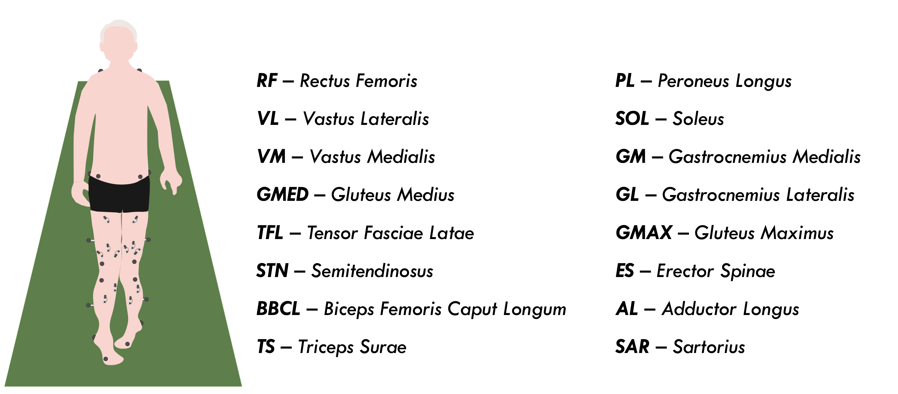
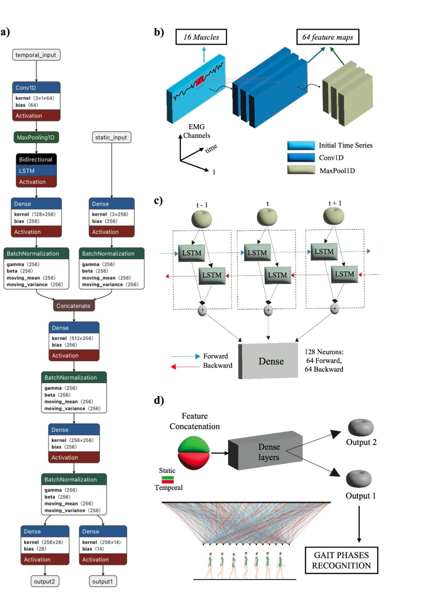
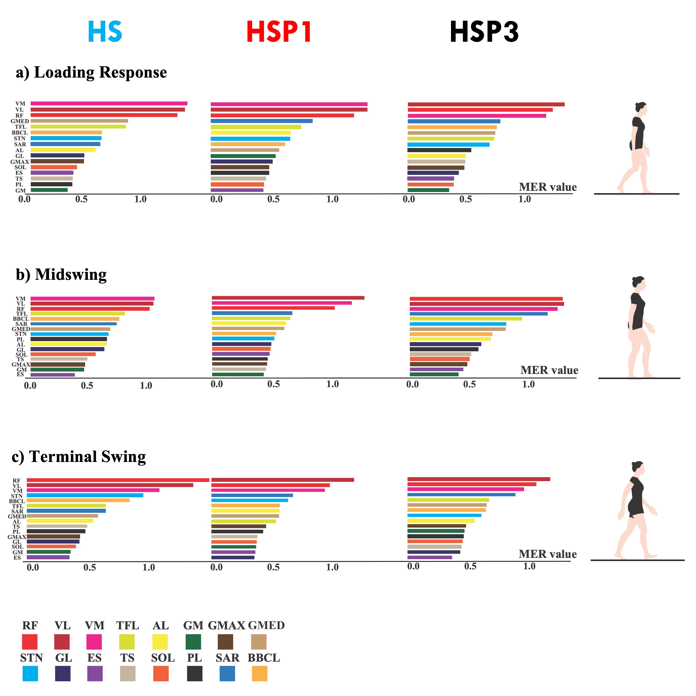
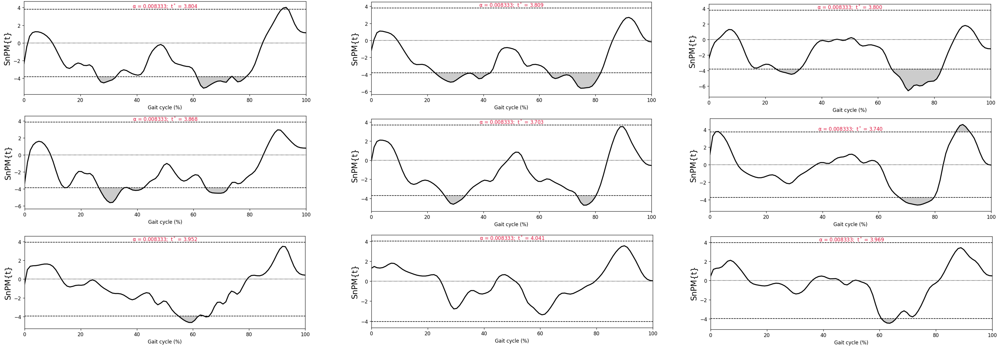

# From EMG to Insight — Explainable Deep Learning on Stiff-Knee Gait in HSP

> **Clean envelopes ➜ whole-cycle nonparametric SPM ➜ tv-VAR IRFs (EMG↔KIN) ➜ Proximal vs Distal EMG directionality**  
> High accuracy + full interpretability: from black-box AI to muscle–phase therapeutic maps.


# **📄 Paper Submission:**  
This repository supports the upcoming manuscript **“From EMG to Insight: Explainable Deep Learning Identifies Muscle Drivers of Stiff-Knee Gait in Hereditary Spastic Paraparesis”**, which will be submitted shortly to a peer-reviewed journal.


---
##  Background

Large surface-EMG datasets in neurological gait disorders hold untapped clinical information — but which **muscle**, **when**, and **how much**?  
We developed a fully explainable deep learning pipeline to map muscle×phase determinants of **stiff-knee gait** in **Hereditary Spastic Paraparesis (HSP)**.

- **Subjects:** 43 total (26 HSP, 17 HS)  
- **Clinical subgroups:** HSP1 (severe), HSP2 (moderate), HSP3 (mild)  
- **sEMG:** 16 bilateral muscles (32 channels @1000 Hz)  
- **3D Kinematics:** 100 Hz  
- **Gait cycles:** 3 valid cycles per subject  
- **Normalization:** 0–100% gait cycle; 7 gait sub-phases  

---
## Pipeline Overview



---
##  Quick Start

```bash
# 1. Install dependencies
pip install numpy pandas matplotlib scipy statsmodels scikit-learn spm1d joblib openpyxl xlsxwriter

# 2. Place your raw CSV (Italian field names supported)
#    sEMG data HSP/Timeseries completo.csv

# 3. Run the script (Jupyter or CLI)
python EMG_HSP_Explainability.py

Outputs appear automatically in the `outputs/` folder:

- `Parameters4.xlsx` — preprocessing features  
- `spm_clusters_corrected.xlsx` — SPM clusters (Holm/FDR)  
- `results_irf.xlsx` — EMG↔KIN (XCorr/HAC/Granger/FDR + IRFs)  
- `emg2emg_DI_heatmap.png` + per-phase bar charts
```

---

## 🏗️ Architecture

| Section | Goal | Key Outputs |
|---------|------|-------------|
| **1. Pre-processing** | Clean envelopes, normalize EMG, resample 0–100% gait cycle | Parameters4.xlsx, overview plots |
| **2. Whole-cycle SPM (nonparam)** | Compare full time-series between groups (Holm+FDR) | spm_clusters_corrected.xlsx, SPM plots with q annotations |
| **3. EMG↔Kinematics** | tv-VAR IRFs, Granger causality, HAC OLS | results_irf.xlsx, controller flowmaps |
| **4. Proximal↔Distal EMG** | Directionality Index (DI), phase-specific drivers | emg2emg_DI_heatmap.png, per-phase bar charts |

---

## 🎯 Model Performance

| Task | Accuracy | AUC / F1 |
|------|----------|----------|
| **Binary (HS vs HSP)** | 91.2% | AUC 0.95, F1 0.94 |
| **Multiclass (HS, HSP1–3)** | 91.4% | F1 ≥0.86 in all 28 cells |

---

## 💡 Explainability Highlights

- **Quadriceps dominance:** RF, VL, VM emerge as main drivers across phases.  
- **MER metric:** High MER → stereotyped activation; Low MER → adaptive complexity.  
- **Proximal–distal interactions:** Controls show alternation; HSP1 shows monochromatic blocks (loss of alternation).  
- **Clinical bridge:** From deep learning to interpretable, muscle–phase therapeutic maps.

---

## 🖼 Deep Learning Architecture & Outputs

### Network Diagram


### MER Barplots per Phase


### EMG ↔ Kinematics Directionality


### Proximal vs Distal Directionality


### SPM Nonparametric Plots


---

## 📜 Citation

If you use this code or dataset, please cite:

> **Trabassi D. et al.** From EMG to Insight: Explainable Deep Learning Identifies Muscle Drivers of Stiff-Knee Gait in Hereditary Spastic Paraparesis. *SIAMOC 2025*.

---

## 🧩 Repository Structure
├── EMG_HSP_Explainability.py    # Main pipeline
├── outputs/                     # Generated figures and tables
├── docs/                        # Images (pipeline, figures)
├── data/                        # (Optional) input CSVs (add to .gitignore)
└── README.md

---

## ⚠️ Data Privacy

This repository does **not** contain raw patient data.  
Placeholders / synthetic examples are provided for reproducibility.  
Please respect privacy regulations (GDPR) when using your own data.

---

## 👨‍💻 Code Authors

- **Dante Trabassi** — main pipeline, preprocessing, complementary code modules
- **Stefano Filippo Castiglia** — explainability pipeline, analyses  

---

## 🙌 Acknowledgments

- Prof. Mariano Serrao (supervision)  
- Ing. Alberto Ranavolo
- Ing. Irene Gennarelli   
- Ing. Tiwana Varrecchia  
---
